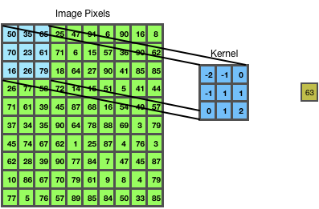

# 				Topics

**<u>Convolution</u>**:- Before we actually go into convolution , lets unstand how images are stored in computers. Any color image can be represented as a set of numbers, to be precise the image can be thought of consisting of numbers in 3 different channels. These channels are called as R,G,B channels. As a experiment we can take the Red,Blue and Green colors and can mix them in varous proportions.These then can result in different colors based on the proportion of R,G and B. As mentioned previously, in each of the channel the image can be represented as varous number ranging from 0 to 255. These numbers correspond to pixel intensities of the image

Below is an example of an Image , which was split into its respective R,G,B channels

Convolution is a process in which each pixel is multiplied by the corresponding value of a Kernal (matrix of values) and the result is added together. This can easily be understood when images are taken into consideration.

Shown below in the diagram is a representation of image with its pixel values. It is accompanied by a Kernel with its own values. After the convolution is carried out, the resultant value is show in the right hand corner

The convoluted output can be calculated as follows :

**Convolution o/p =** **Image Pixels::A1×Kernel::A1 + Image Pixels::B1×Kernel::B1 + Image Pixels::C1×Kernel::C1 + Image Pixels::A2×Kernel::A2 + Image Pixels::B2×Kernel::B2 + Image Pixels::C2×Kernel::C2+Image Pixels::A3×Kernel::A3 + Image Pixels::B3×Kernel::B3 + Image Pixels::C3×Kernel::C3**

In the above example the Kernel size is 3x3 and the Image size is 10x10

During the convolution process, the image kernel is slided across the image as per the defined number of slides. 

**<u>Filters/Kernels:</u>** In the above example as part of the convolution an image kernel is defined. The image kernel is nothing but a set of number which are multiplied with the corresponding pixel values of the image. Almost as part of the convention the kernels are square kernels i.e. of the size nxn. In the above example the size is 3x3. Although image kernels can be defined with higher sizes such as 5x5,7x7 etc..always 3x3 kernel sizes are preferred. This is due to the fact these are efficient during computation and the scientific libraries contained optimized implementations.So what does the image kernel do? The image kernel helps in identifying certain features of the given image. So during this process it helps discover the presence of certain features. But for us to extract these feature the kernels need to be pre-defined with certain values. Some examples of image kernels are blur,bottom sobel,emboss,identity,outline,sharpen etc..(shown below)
$$
Sharpen\,Kernel \ \ \ Emboss\,Kernel \ \ \ Outline\,Kernel\\
\left( \begin{matrix}
  \mathbb 0  & \mathbb -1  & \mathbb 0 \\
  \mathbb -1  & \mathbb 5  & \mathbb -1 \\
  \mathbb 0  & \mathbb -1  & \mathbb 0
  \end{matrix}
  \right)
\
  \left( 
  \begin{matrix}
  \mathbb -2  & \mathbb -1  & \mathbb 0 \\
  \mathbb -1  & \mathbb 1  & \mathbb 1 \\
  \mathbb 0  & \mathbb -1  & \mathbb 2 
  \end{matrix}
   \right)
  \
  \left( 
  \begin{matrix}
  \mathbb -1  & \mathbb -1  & \mathbb -1 \\
  \mathbb -1  & \mathbb 8  & \mathbb -1 \\
  \mathbb -1  & \mathbb -1  & \mathbb -1 
  \end{matrix}
   \right)
$$
In CNN, these filters are not predefined, instead these are learned as part of the training process.In CNN for each layer, in addition the legth and width of the kernel, we also define the number of kernels/filter . This will result in an output where the number of channels will be same as that of the number kernels/filter defined for convolution.

Ex:- 5x5,3 channels is convolved with 3x3,3 channels of **<u>32 filters</u>** result in 3x3,**<u>32 channels</u>** output.

**<u>Epochs</u>** :- An epoch in deep learning can be described as number of times a neural network go through the entire training set.Generally when training a neural network, the DNN has to see the training set many times. This basically helps the DNN reduce the loss and help it to converge. However it may be noted that due to the limitations of existing compute i.e. GPU RAM, the DNN might not be able to see all the training examples at once. As a workaround we generally split the entire training set into small subsets. Each subset is known as **mini-batch**. The size of the mini-batch depends on the size of each training example along with the available GPU RAM. Please note the **mini-batch** essentially need to represent the entire training dataset in terms of distribution of classes. Along with this the **mini-batch** also needs to have randomized selection of training examples without replacement.

All popular frameworks allow us to set the number of epochs and min-batch. Below is the example of how these parameters are setup in Keras:

model.fit(X_train,y_train, epochs = 50, batch_size = 30)

**<u>1x1 convolution</u>**:- A 1x1 convolution is also called as Network in Network may also be used in CNN. Although this looks trivial as this simply multiplies each pixe and doesn't change the dimensions along the length and breadth, this will help with changing the dimensions along the depth. Lets consider the examples below :

Example1:-

Input : 5x5, 3 channels

Kernel : 1x1,3 channels of 64 filters

Output : 5x5, 64 channels ---Depth is increased to 64 from 3

Example2:-

Input : 5x5, 32 channels

Kernel : 1x1,32 channels of 16 filters

Output : 5x5, 16 channels ---Depth is decreased from 32 to 16

The important advantage of using 1x1 convolution is decrease in the number of computations. Hence 1x1 convolutions can be used to replace the fully connected layers in a CNN, thus helping with reducing the size of the CNN.

**<u>3x3 convolution</u>**:- A 3x3 convolution can be defined as a convolution in which a kernel/filter of size 3x3 is used.So why do we need to use 3x3 kernels for convolution? Can we not use higher kernel sizes for convolution? Indeed if we closely observe we can also use higher kernel sizes during convolutions. However this is not recommended due to the fact that 3x3 convolutions are computationally efficient. Also higher kernel size convolution effects can be derived by using more than single 3x3 convolutions. Lets see an example on this.

Consider the following :

Example1:-

Input : 5x5, 3 channels

Kernel: 5x5, 3 channels 1 filter

Output: 1x1, 1 channel

Example2:-

Input : 5x5, 3 channels

Kernel1: 3x3, 3 channels 1 filter

Output1: 3x3, 1 channel

Kernel2: 3x3, 1 channel 1 filter

Output: 1x1, 1 channel

If you observer example1 and example2, we are able to achieve the same effect of convolving a 5x5 image with 5x5 kernel using two 3x3 convolutions

Following are some of the observations using two 3x3 convolutions Vs one 5x5 convolution on a 5x5 image

- Number of weights when two 3x3 convolutions were used is 18 Vs Number of weights when one 5x5 convolution was used is 25

- Number of layers for 3x3 convolutions is more than 5x5 convolutions , hence more GPU RAM may be needed 

- A 3x3 convolution might help learn detail,complex features and thus help identify features related to small images, however this may not be possible with 5x5 convolution

<u>**Feature Maps**</u>:-During a convolution operation the result that is obtained when an input image is convolved with a kernel/filter is store in feature map.It has to be noted that a single feature map contains the result of the convolutions for all pixels of the input image.Also each filter generates its corresponding feature maps after convolution. This is illustrated in the below example:

Input : 5x5, 3 channels

Kernel: 3x3, 3 channels 32 filters

Output: 3x3, 32 channels

Here the number of feature maps in the output is 32

Now consider a pre-trained CNN which was trained on ImageNet data, if were to visualize the feature maps in each of the layers, it appears that the layers near to the input seem to have learnt the basic features i.e. lines, curves etc..and as we proceed farther from input the layers seem to learn more complex shapes and textures. This intitution can come in handy if were to use a pre-trained network as a starting point.

**<u>Feature Engineering (older computer vision concept)</u>**:- If were to manually design an algorithm for classification of images in computer vision domain, we need to manually engineer features that can help perform this task i.e. image classification.These features can represent different parts of the image or entire image. Obviously inorder to design such features, we need lot of domain knowledge and understanding of the problem at hand. As a example lets say we need to detect faces. In this example, we might need to create features such as distance between eyes, shape of the eyes, location of the eyes and other parts of the face..etc. These need to be hand engineered/created and then had to be manually embedded into the algorithm. Although this may work fine upto certain extent, this involves lot of work along with good knowledge of domain. This can be a drawback at times which can prevent the usage of feature engineering. Also this may fail if the training examples are diverse and complex as it becomes difficult to design features that cover all possible examples. In modern times, instead of hand engineering the features, the algorithm can learn the features themselves. This is possible with DNN(Deep Neural Networks).

​								

​														Name : Sasikanth Kotti, Batch 8

​														email : kotti.sasikanth@gmail.com 

​														